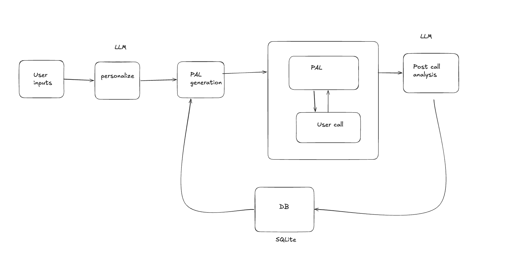

# Personalized Interviews

Two personalized conversation demos built with Tavus CVI:

| Demo | Why it matters |
| --- | --- |
| Surrogate intake | My friend [Sahil Gupta](https://www.linkedin.com/in/sahilgup/), who runs a surrogacy business, estimates that only about 1 in 100 interested candidates reaches a match. This provides a warm, personalized first conversation at lower cost and is available 24/7, while keeping human follow-up available. |
| Medical-rep training | Inspired by a similar training problem at [Merck](https://www.linkedin.com/company/merck/). Representatives can practice different scenarios, geographies, and personas, then receive transcript-backed coaching without rebuilding the training program each time. |

## Tavus features

| Feature | Why we use it |
| --- | --- |
| [CVI conversations](https://docs.tavus.io/api-reference/conversations/create-conversation) | Runs the realtime video role-play. |
| [Dynamic PALs](https://docs.tavus.io/api-reference/pals/create-pal) | Generates a tailored character, greeting, and scenario for every session. |
| [Objectives](https://docs.tavus.io/api-reference/objectives/create-objectives) | Turns the generated session goals into Tavus-tracked verbal objectives for that PAL. |
| [PAL tools](https://docs.tavus.io/sections/conversational-video-interface/pal/llm-tool) | Saves intake answers, callbacks, objections, and completion results. |
| [Private rooms](https://docs.tavus.io/sections/conversational-video-interface/conversation/customizations/private-rooms) | Requires a meeting token and limits each room to the participant and PAL. |
| [Memory](https://docs.tavus.io/sections/conversational-video-interface/memories) | Carries useful context across sales-training sessions without sending the email to Tavus. Memory is disabled for surrogacy. |
| [Transcripts](https://docs.tavus.io/api-reference/conversations/get-conversation) | Produces the surrogate recap or medical-rep coaching report after the call. |

## Architecture

React and Vite provide the UI. Express keeps provider keys server-side and connects to Tavus. SQLite stores participants and sessions, OpenAI generates structured post-call reports, and Resend handles requested human follow-ups.



## Data flow

1. **Form to dynamic PAL:** The server sends the submitted name, situation, goals, and relevant prior-session brief to OpenAI for strict structured-output generation. The generated identity, greeting, conversational context, semantic casting profile, and objectives are validated, then merged with code-owned safety rules. Tavus creates an Objective set, a session-specific PAL, and a private conversation instead of using one fixed character.
2. **Useful continuity by email:** The server normalizes the email and uses it to find or create the same participant in SQLite. Confirmed answers are saved during the call; session results and a short brief are saved after completion. On the next visit with that email, relevant confirmed details are reused even when the prior call was interrupted, and the latest useful session notes are included in the new PAL's context. The PAL treats these notes as context to confirm, not unquestionable facts.
3. **Information saved during the call:** PAL tool calls store confirmed intake answers, callback requests, objections, and completion events in SQLite as the conversation happens.
4. **Post-call insights:** At the end, the Tavus transcript is sent to OpenAI for structured extraction. The surrogacy flow produces a recap of details collected, unanswered questions, and next steps; the medical-rep flow produces transcript-backed scores, strengths, improvement areas, risky statements, and a practice plan. These insights are saved with the session and shown in the result screen.

The PAL and Objective set are temporary. Their IDs are stored with the server-side session and both resources are deleted when the conversation ends or the user returns home.

Surrogacy continuity stays in our SQLite database. Medical-rep training can additionally use a pseudonymous Tavus memory store, but the participant's email is never sent to Tavus.

## Run locally

```bash
cp .env.example .env.local
npm install
npm run dev
```

Open [http://127.0.0.1:3137](http://127.0.0.1:3137).

## Environment keys

Copy `.env.example` to `.env.local`, then set:

| Key | Needed for |
| --- | --- |
| `TAVUS_API_KEY` | Required. Creates PALs and runs Tavus conversations. |
| `OPENAI_API_KEY` | Required. Generates each session-specific PAL configuration and transcript-based post-call reports. |
| `OPENAI_MODEL` | Optional shared model override. Defaults to `gpt-5-mini`. |
| `OPENAI_CONFIG_MODEL` | Optional model override for PAL configuration generation only. |
| `RESEND_API_KEY` | Optional. Sends human follow-up requests. Use it with `ESCALATION_EMAIL`. |
| `ESCALATION_EMAIL` | Optional. Address that receives human follow-up requests. |
| `EMAIL_FROM` | Optional. Resend sender address. Defaults to the Resend onboarding sender. |
| `TAVUS_FACE_ID` | Optional. Forces a specific completed Tavus stock face; otherwise the app selects one. |
| `DATABASE_URL` | Optional. SQLite file path. Defaults to `./data/personalized-interviews.db`. |
| `PORT` | Optional. Local server port. Defaults to `3137`. |

Keep `.env.local` private. Only `.env.example`, with blank values, belongs in Git.

## Verify

```bash
npm test
npm run typecheck
npm run build
```
